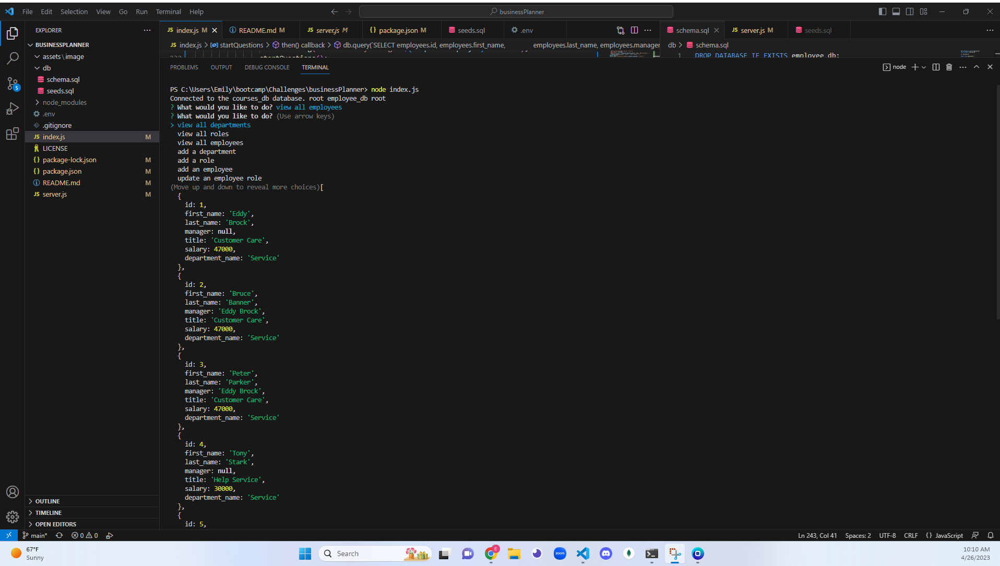

# businessPlanner

## Description

This project will help keep businesss stay organized. The user will be able organize thier departments, roles, and employees, just by answering prompts. Through this project I gained a lot of understanding of mysql. 

## Installation

Here are the steps to get this project running. 
1. sign in to your mysql in the terminal 
2. run `SOURCE db/schema.sql` 
3. `exit` the mysql terminal
4. run `node index.js` 

## Usage

Once you have completed the Installation you can start ansering the prompts. The information will be presented as objects. as shown below. 

## Credits

I used express, inquier, and mysql2 for this project. 

## License

MIT